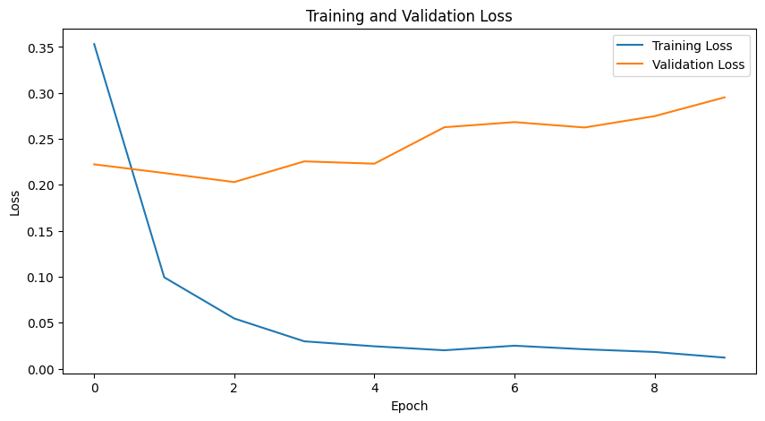
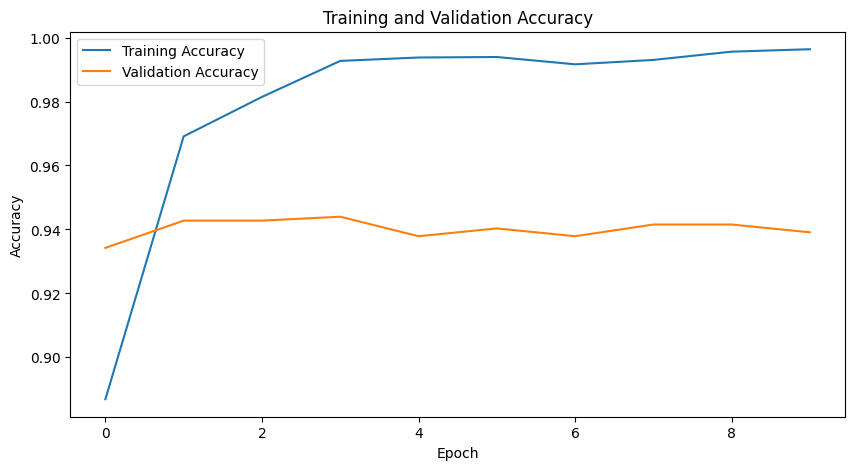

# Project V 

# Waste Classification Model

## Problem Statement

The Waste Classification Model is designed to accurately classify different types of waste based on input images. The goal of this project is to provide a reliable and efficient solution for waste management, enabling automated waste classification and facilitating proper disposal and recycling.

The primary motivation behind this dataset is to address the importance of garbage recycling in preserving our environment. Sorting garbage into groups with similar recycling processes is crucial for effective recycling. Existing datasets typically classify garbage into a limited number of classes, usually ranging from 2 to 6. By expanding the number of classes for household garbage classification, we can significantly increase the recycling rate.

To collect the data, an ideal setup would involve placing a camera above a conveyor belt where garbage items pass one by one, allowing the camera to capture real garbage images. However, such a setup is currently not feasible. As a result, most of the images in this dataset were collected through web scraping. Whenever possible, efforts were made to gather images closely related to garbage items. For example, for the biological waste category, images of rotten vegetables, fruits, and food remains were searched for. However, obtaining images specifically depicting clothes or shoes from the garbage proved to be more challenging. Therefore, the dataset primarily contains images of regular clothes. Nonetheless, the ability to classify these images into 12 different classes represents a significant step towards improving the recycling process.

By utilizing this dataset, we aim to develop a waste classification model that can accurately categorize household garbage, thereby contributing to the advancement of recycling practices.

## Exploratory Analysys

### 1. Photo dataset
The model was trained using a comprehensive dataset of waste images. The dataset contains labeled images representing various waste categories such as batteries, biological waste, cardboard, glass, metal, paper, plastic, and trash. The dataset was collected from diverse sources and manually annotated to ensure high-quality training data.

### 2. Recycling situation

#### European Recycling Trends

The amount of waste generated in Europe has been increasing year after year.
However, the recycling rate per capita and recycling rate by materials have remained relatively constant over the years.
This suggests that despite the implementation of measures and awareness campaigns, the desired impact on recycling behavior has not been achieved

#### Spanish Recycling Trends

In Spain, there has been exponential growth in plastic recycling, while cardboard recycling has remained stable since 2018.
This indicates that the awareness campaigns and measures implemented in Spain have been successful in promoting plastic recycling.
Collection of Waste and Population:

As the population grows, there is no proportional increase in the amount of waste being recycled.
This finding highlights the need for further efforts to encourage recycling behavior as the population expands.

#### Madrid Recycling Trends

In Madrid, there is an observable evolution in recycling patterns over the years.
Different materials show a balanced increase in their recycling rates, suggesting positive progress in recycling practices within the city.

The analysis of recycling trends reveals the complexities associated with changing recycling behaviors. While some regions experience positive impacts from awareness campaigns and measures, others struggle to achieve significant improvements. The findings emphasize the ongoing need for innovative strategies and continued efforts to promote sustainable recycling practices in order to mitigate the environmental impact of waste.

## 3. Dataset

The dataset used in this project consists of 15,150 images representing 12 different classes of household garbage. These classes include paper, cardboard, biological waste, metal, plastic, green glass, brown glass, white glass, clothes, shoes, batteries, and trash.

The SuperStore dataset used for this project should be accessible via the Kaggle: https://www.kaggle.com/datasets/mostafaabla/garbage-classification?datasetId=1115942&sortBy=voteCount

## 4. Machine Learning

The EfficientNet-50 is a deep neural network model that belongs to the EfficientNet family of models. It is designed to achieve a balance between model accuracy and computational efficiency, making it suitable for various computer vision tasks, including image classification.

The EfficientNet-50 model architecture consists of multiple layers, including convolutional layers, pooling layers, and fully connected layers. These layers are stacked together to form a deep network capable of learning complex patterns and features from input images.

One of the key features of the EfficientNet-50 model is its use of compound scaling, which optimizes the model's depth, width, and resolution simultaneously. This allows the model to efficiently scale up and down to different sizes, making it adaptable to different resource constraints.

## 5. Results

The model went through several stages of development and evaluation.

Image Verification: The dataset underwent a thorough image verification process to ensure data quality and remove any corrupted or invalid images.

Dataframe Creation: A structured data representation was created in the form of a dataframe, where each image was associated with its corresponding category label.

EfficientNet-50 Model Creation: The EfficientNet-50 model was built and trained using 80% of the data for training, 10% for validation, and 10% for testing. Different hyperparameters, such as the number of classes, layers, epochs, and image size, were iteratively tuned to optimize the model's performance.

Model Evaluation: After training, the model achieved an accuracy of 94% on the test set. However, it exhibited a 36% precision in predicting the majority class, indicating a potential class imbalance issue.

Model Improvement Measures: Several measures were taken to improve the model's performance:

Increased the number of epochs to allow for more extensive training and potentially capture additional patterns in the data.
Applied data augmentation techniques to artificially increase the diversity of the training data and improve the model's ability to generalize.
Utilized undersampling to address the class imbalance by reducing the number of samples from the majority class.

## 6. Conclusions

Despite these improvement attempts, the loss remained consistent, and the prediction accuracy did not significantly improve. The model continued to struggle with predicting the majority class accurately.

## 7. Sources

https://ec.europa.eu/eurostat/databrowser/product/view/ENV_WASPAC

https://www.comunidad.madrid/servicios/urbanismo-medio-ambiente/residuos

https://www.ecoembestransparencia.com/datos/envases-domesticos-ligeros/

